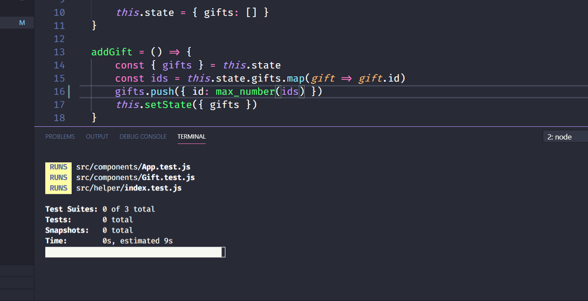

# GiftGiver
React project developed to learn automated testing using Jest, Enzyme, and TDD. :smile:

Simple project that lets you create a list of gifts and people. Not too interesting, but certainly really valuable in terms of learning. Soon a new and greater project also implementing automated testing. :wink:

### See the result! :point_down:
https://carloseustaquio.github.io/giftgiver/

### Demo:

